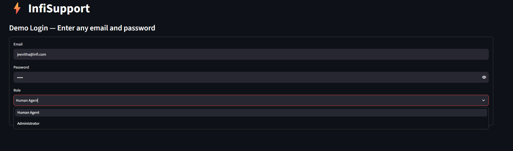
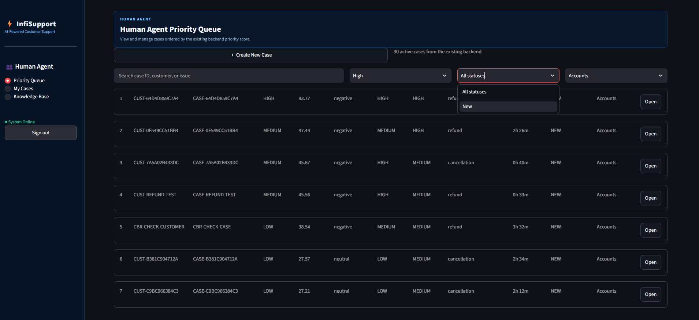
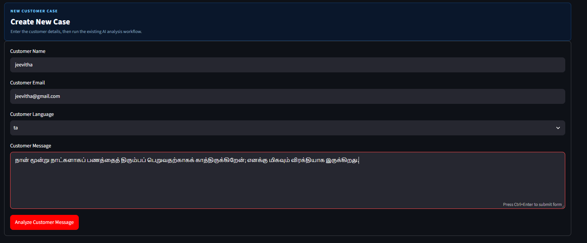
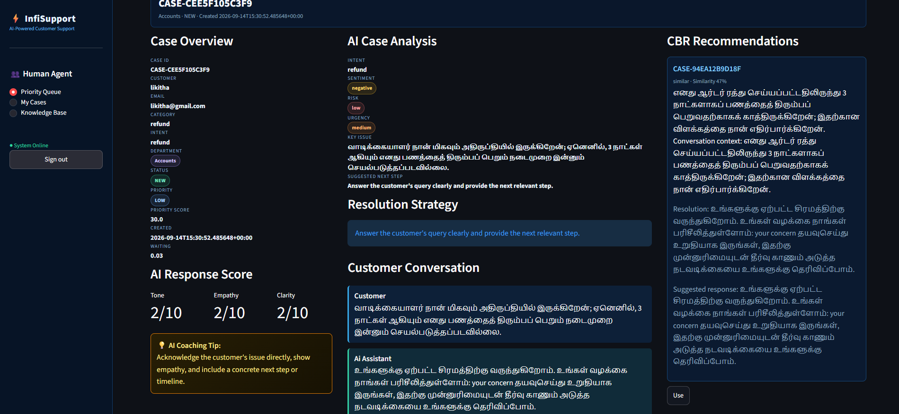
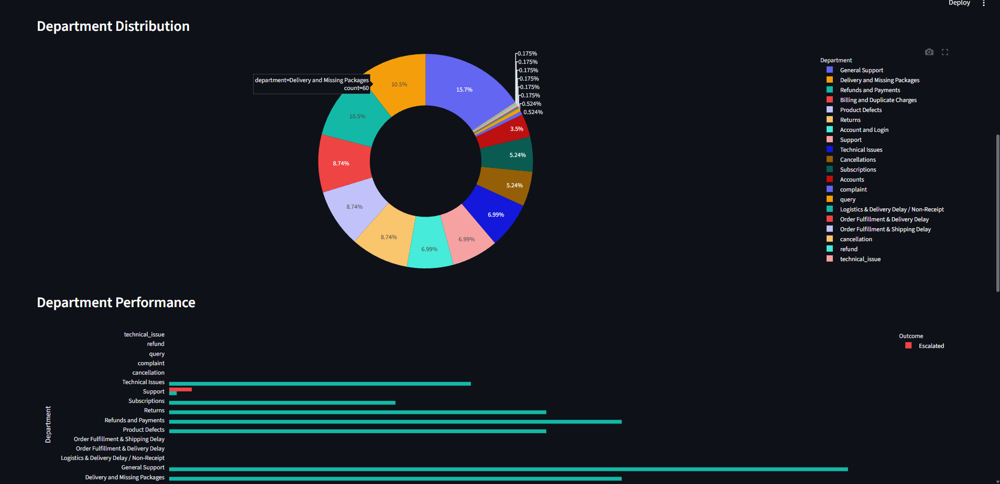
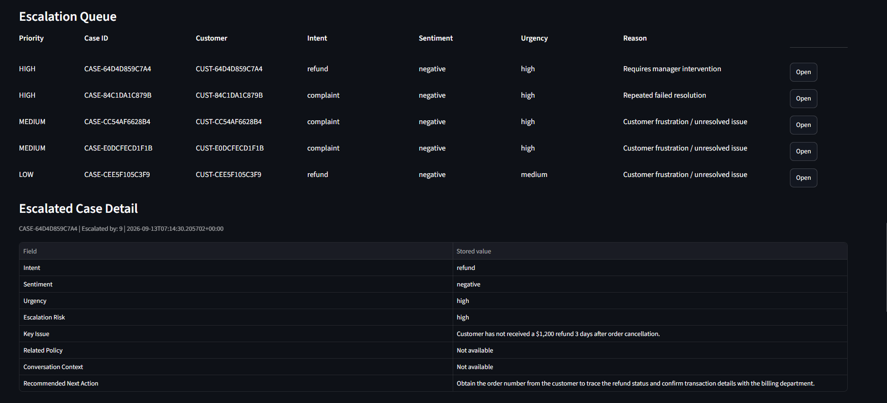
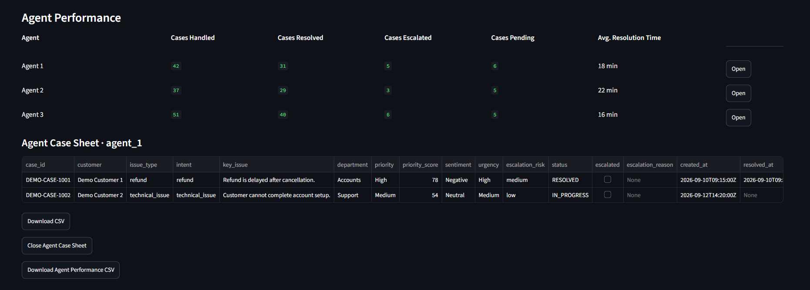

# AI-Powered Customer Support Assistant with Live Response Guidance

An AI-powered customer support platform that helps human support agents analyze customer issues, retrieve relevant historical cases and company policies, generate contextual responses, and receive real-time coaching before responding to customers.

The system combines **NLP, Large Language Models, Case-Based Reasoning (CBR), Policy RAG, PostgreSQL, and agent coaching** into a single human-in-the-loop support workflow.

---

## Overview

Customer support agents often need to make decisions quickly while handling multiple conversations simultaneously.

A customer message may require the agent to understand:

- What the customer is asking about
- Whether the customer is frustrated or satisfied
- What type of issue is involved
- Whether the issue should be routed to another department
- How similar cases were resolved previously
- Which company policy applies
- How the agent should respond appropriately

This project provides an AI-assisted workflow for these tasks.

Instead of simply generating an answer using an LLM, the system follows:

**Customer Message → NLP Analysis → Historical Case Retrieval → Policy Retrieval → AI Reasoning → Suggested Response → Agent Coaching → Human Decision**

The final response is always reviewed and controlled by the human agent.

---

## Key Features

### 1. AI Customer Message Analysis

The system analyzes incoming customer messages to identify important support signals.

The analysis includes:

- Customer sentiment
- Customer intent
- Key issue
- Urgency
- Escalation risk
- Priority
- Recommended next step
- Department routing

The NLP layer uses **Hugging Face Transformers** for sentiment and intent classification where the required model assets are available.

The LLM is then used for contextual reasoning and response synthesis rather than being the sole source of basic sentiment and intent classification.

---

## 2. Sentiment Analysis

The system uses the Hugging Face Transformers sentiment-analysis pipeline to identify the customer's sentiment.

The application normalizes sentiment into:

- Positive
- Neutral
- Negative

### Example

**Customer message:**

> "I'm extremely disappointed. My refund has been delayed for days."

**Detected sentiment:**

`Negative`

Customer sentiment is then provided as structured context to the downstream AI reasoning process.

---

## 3. Intent Classification

The system uses Hugging Face Transformers for customer intent classification.

The supported intents include:

- Complaint
- Query
- Purchase
- Technical Issue
- Feedback
- Cancellation
- Refund

### Example

**Customer message:**

> "I cancelled my order three days ago but still haven't received my refund."

**Detected intent:**

`Refund`

The detected intent is passed to the downstream AI reasoning and retrieval components to provide more context-aware assistance.

---

## 4. Case-Based Reasoning (CBR)

Customer-support teams often encounter issues that are similar to cases they have already solved.

The system uses **Case-Based Reasoning (CBR)** to retrieve relevant historical cases and provide previous resolution experience as context.

The CBR workflow is:

**Current Customer Issue → Sentence Embedding → Similarity Search → Relevant Historical Cases → AI Response Generation**

The system uses **SentenceTransformer embeddings** to measure semantic similarity between the current customer issue and previously resolved cases.

Retrieved cases provide information such as:

- Historical Case ID
- Customer issue
- Category / Intent
- Resolution summary
- Similarity score

The agent can select a relevant historical case using the **Use** option.

The historical response is **not copied directly**.

Instead, the selected case is provided as context to the AI together with the current customer issue so that a new response can be generated.

This allows the system to reuse previous support experience while adapting the response to the current customer.

---

## 5. Policy RAG

Historical cases alone may not always be sufficient because previous resolutions may not represent the current support policy.

The system therefore includes a separate **Policy Retrieval-Augmented Generation (RAG)** component.

The policy knowledge base contains support information related to areas such as:

- Refunds
- Returns
- Cancellations
- Delivery delays
- Damaged or defective products
- Billing and payments
- Account issues
- Escalation and policy exceptions

The workflow is:

**Customer Issue → Policy Retrieval → Relevant Policy References → AI Reasoning → Policy-Aware Response**

CBR and Policy RAG serve different purposes.

### CBR

> "How were similar cases handled previously?"

### Policy RAG

> "What relevant policy should guide the current response?"

The retrieved historical cases and policy information are provided to the AI together with the current case context.

---

## 6. AI Response Generation

After analyzing the customer message and retrieving relevant information, the system uses Gemini for contextual reasoning and response generation.

The AI receives structured information such as:

- Customer message
- Customer sentiment
- Customer intent
- Key issue
- Historical case information
- Relevant policy information
- Current case context

It then generates:

- Suggested response
- Recommended next step
- Response strategy
- Contextual reasoning

The LLM is not used as the only source of basic sentiment and intent classification.

These structured signals are obtained from the NLP layer and provided to the LLM as context.

---

## 7. AI Response Score and Coaching

The system also evaluates the response written or suggested for the human support agent.

The coaching layer is based on the original project concept of:

- Tone Score
- Empathy Score
- Clarity Score
- Coaching Tip

The dashboard displays:

**AI Response Score**

- Tone: X/5
- Empathy: X/5
- Clarity: X/5
- Overall Score: X/5

It also provides a short coaching tip to help the agent improve the response.

### What is being scored?

The score evaluates the **agent's response**, not the customer's message.

It considers:

- Customer sentiment
- Customer intent
- Customer issue
- Appropriate tone
- Empathy
- Clarity

### Example

**Customer:**

> "I'm extremely disappointed. My refund has been delayed for days."

**Weak agent response:**

> "Your request is being processed."

The coaching layer can identify that the response:

- Does not acknowledge the customer's frustration
- Provides limited empathy
- Does not clearly explain the next step

### Improved response

> "I'm sorry for the delay with your refund. I understand how frustrating this must be. I have checked the refund status and will provide you with the next update clearly."

This can result in stronger tone, empathy, and clarity scores.

---

## 8. Human-in-the-Loop Support

The system is designed as an **AI-assisted support platform**, not a fully autonomous chatbot.

The AI provides recommendations, but the human agent remains responsible for the final response.

The workflow is:

**AI Analysis → Recommendations → Agent Review → Response Coaching → Agent Edits → Send / Resolve / Escalate**

This allows agents to use AI assistance while maintaining human control over customer communication.

---

## 9. Dynamic Priority Queue

The Human Agent dashboard provides a priority-based queue for handling support cases.

Cases can be evaluated using:

- Priority
- Priority Score
- Sentiment
- Escalation Risk
- Urgency
- Intent
- Waiting Time
- Status
- Department

This helps agents identify cases that require attention instead of treating every case equally.

The system also supports department-based routing.

For example:

- Refunds
- Payments
- Billing
- Transactions

can be routed to the **Accounts** department, while general customer issues can remain with **Support**.

---

## 10. Case Workspace

Each support case has a dedicated workspace where the agent can review the complete case context.

### Case Overview

The workspace can display:

- Case ID
- Customer
- Created time
- Status
- Priority
- Department
- Intent
- Sentiment
- Urgency
- Escalation Risk
- Key Issue

### AI Case Analysis

The agent can review:

- Customer sentiment
- Customer intent
- Key issue
- Recommended next step
- AI reasoning / strategy

### Customer Conversation

The complete conversation history is available for the agent.

### Suggested Response

The AI-generated response is displayed for the agent to review and edit before sending.

### CBR Recommendations

Relevant historical cases are displayed with similarity information and a **Use** option.

### Policy References

Relevant policy sections retrieved from the policy knowledge base are displayed to support the response.

---

## 11. Case Lifecycle

The system supports the complete support-case lifecycle.

A case can move through:

**NEW → IN PROGRESS → RESOLVED**

or:

**NEW → IN PROGRESS → ESCALATED**

Important actions are stored as case events, including:

- AI Analysis
- AI Recommendation
- Recommendation Used
- Recommendation Rejected
- Department Transfer
- Escalation
- Resolution

This provides a persistent history of important actions performed on a case.

---

## 12. Escalation

Human agents can escalate cases when additional support or intervention is required.

The system stores escalation information such as:

- Escalation status
- Escalation reason
- Escalation timestamp
- Escalating agent
- Case history

Escalated cases can also be surfaced in the Administrator dashboard.

The existing case analysis and conversation history are preserved during escalation.

---

## 13. Multilingual Support

The application supports customer conversations in multiple languages, including:

- English
- Hindi
- Tamil

The original customer message is preserved.

The system can generate AI-assisted responses in the customer's language while keeping the conversation context available to the human agent.

The final response remains under human-agent control.

---

## 14. Administrator Dashboard

The application includes an Administrator dashboard for monitoring support operations.

The dashboard provides information such as:

- Total Cases
- Resolved Cases
- Escalated Cases
- Pending Cases
- Department Distribution
- Resolution Performance
- Agent Performance
- Escalation Queue
- Case Trends

The dashboard can also provide downloadable case and performance information.

### Agent Performance

Administrators can review:

- Agent
- Cases Handled
- Cases Resolved
- Cases Escalated
- Cases Pending
- Average Resolution Time

Administrators can also open an agent's details to review the cases handled by that agent.

---

## 15. PostgreSQL Database

The application uses **PostgreSQL** as the persistent source of truth.

The main database tables are:

- `users`
- `customers`
- `cases`
- `messages`
- `case_events`

### Users

Stores application users and their roles.

Supported roles include:

- Human Agent
- Administrator

### Customers

Stores customer information such as:

- Name
- Email
- Language
- Customer Tier

### Cases

Stores the main support case information, including:

- Case ID
- Customer
- Assigned Agent
- Status
- Department
- Intent
- Sentiment
- Urgency
- Severity
- Escalation Risk
- Priority
- Resolution Information
- AI Assistance Information

### Messages

Stores customer and agent conversation messages.

### Case Events

Stores important actions and events throughout the case lifecycle.

---


## 16. Technology Stack

| Component | Technology |
|---|---|
| Frontend | Streamlit |
| Backend | FastAPI |
| Programming Language | Python |
| NLP | Hugging Face Transformers |
| LLM | Gemini |
| Embeddings | SentenceTransformers |
| Case-Based Reasoning | Vector Similarity Search |
| Policy Retrieval | Policy RAG |
| Database | PostgreSQL / Neon |
| ORM | SQLAlchemy |
| Authentication | JWT + bcrypt |
| API | REST |
| Version Control | Git / GitHub |

---

## 17. Project Structure

```text
infosys_internship/
│
├── .vscode/
│
├── venv/
│
├── .env
├── .gitignore
│
├── ai_cus_backend.py
├── frontend.py
├── vector_db.py
│
├── create_schema.py
├── initialize_users.py
├── seed_cbr_cases.py
│
├── run_backend.ps1
├── run_frontend.ps1
│
├── GUIDELINE.md
├── UPDATES.txt
└── requirements.txt
```


## 18. Requirements

Before running the project, make sure you have:

- Python 3.10+
- Git
- A PostgreSQL / Neon PostgreSQL database
- A Gemini API key
- Internet access for required AI/model dependencies

Clone the repository:

```bash
git clone <YOUR_GITHUB_REPOSITORY_URL>
cd infosys_internship
```

---

##  19. Application Screenshots

### Login



Role-based access for Human Agents and Administrators.

### Human Agent — Priority Queue



The Priority Queue provides a centralized view of customer cases with priority, priority score, sentiment, escalation risk, urgency, intent, waiting time, status, and department.

### Human Agent — New Case



Agents can create and process new customer cases through the support workspace.

### Human Agent — AI Guidance



The AI-powered workspace provides customer analysis, suggested responses, CBR recommendations, policy references, and response coaching to assist the human agent.

### Administrator Dashboard



The Administrator Dashboard provides an overview of support operations, including case metrics, department-level analytics, and escalation monitoring.

### Administrator — Escalation Management



Administrators can monitor escalated cases and review the stored case analysis and relevant case information, can also see detailed Summary of escalted case .

### Administrator — Agent Performance



Agent Performance provides information about cases handled, resolved, escalated, pending cases, and average case resolution time.

1. Can Download CSV file of overall agent performance 
2. Can Download CSV file of individual agent performance 

---

## 20. Create Virtual Environment

Create the virtual environment:

```powershell
python -m venv venv
```

Activate it:

```powershell
.\venv\Scripts\Activate.ps1
```

If PowerShell activation is restricted, you can directly use:

```powershell
.\venv\Scripts\python.exe
```

---

## 21. Install Dependencies

Install the required Python packages:

```powershell
.\venv\Scripts\python.exe -m pip install --upgrade pip
```

Then:

```powershell
.\venv\Scripts\python.exe -m pip install -r requirements.txt
```

---

## 21. Configure Environment Variables

Create a `.env` file in the project root.

Example:

```env
DATABASE_URL=your_neon_postgresql_connection_string
GEMINI_API_KEY=your_gemini_api_key
AUTH_SECRET=your_secure_auth_secret
```

Use your own credentials.

Do **not** commit `.env` to GitHub.

---

## 22. Database Setup

Initialize the database schema:

```powershell
.\venv\Scripts\python.exe create_schema.py
```

Initialize application users:

```powershell
.\venv\Scripts\python.exe initialize_users.py
```

The database stores:

- Users
- Customers
- Cases
- Messages
- Case Events

---

## 23. Seed Historical CBR Cases

To populate the historical case database used by Case-Based Reasoning:

```powershell
.\venv\Scripts\python.exe seed_cbr_cases.py
```

After seeding, new customer issues can be compared against previously resolved cases.

---

## 24. Run the Backend

Start the FastAPI backend:

```powershell
.\venv\Scripts\python.exe -m uvicorn ai_cus_backend:app --port 8001
```

The backend runs on:

```text
http://localhost:8001
```

You can check whether the backend is running using:

```text
http://localhost:8001/health
```

---

## 25. Run the Frontend

Open another terminal and run:

```powershell
.\venv\Scripts\python.exe -m streamlit run frontend.py
```

Streamlit will provide the local application address.

Usually:

```text
http://localhost:8501
```

Open the displayed address in your browser.

---

## 26. How to Try the Application

### Step 1 — Login

Log in as either:

- Human Agent
- Administrator

### Step 2 — Create or Open a Case

Create a new support case or open an existing case.

Example customer message:

> "I cancelled my order three days ago but still haven't received my refund. This is very frustrating."

### Step 3 — Analyze the Customer

The system analyzes the message and determines relevant support signals such as:

- Sentiment
- Intent
- Urgency
- Escalation Risk
- Department
- Key Issue

### Step 4 — Review Historical Cases

The CBR system searches previously resolved cases and displays relevant matches.

### Step 5 — Review Policies

Policy RAG retrieves relevant support policies.

### Step 6 — Generate a Response

The AI combines the current case, historical cases, and policy references to generate a suggested response.

### Step 7 — Review Coaching

The agent can review:

- Tone
- Empathy
- Clarity
- Overall Response Score
- Coaching Tip

### Step 8 — Take Action

The agent can:

- Edit the response
- Send the response
- Resolve the case
- Escalate the case

Relevant case activity is persisted in PostgreSQL.

---

## 27. API Overview

The FastAPI backend provides REST APIs for:

- Authentication
- Customer case processing
- Case creation
- Case retrieval
- Case history
- AI analysis
- CBR recommendations
- Policy retrieval
- Suggested response generation
- Response coaching
- Case resolution
- Case escalation
- Department transfer
- Administrator analytics

The API documentation can also be accessed through FastAPI when the backend is running.

---


---

## 28. Example End-to-End Workflow

A typical customer-support interaction follows this flow:

```text
Customer sends message
        │
        ▼
NLP Analysis
        │
        ├── Sentiment
        └── Intent
        │
        ▼
Case Context Extraction
        │
        ├── Key Issue
        ├── Urgency
        └── Escalation Risk
        │
        ├───────────────┐
        ▼               ▼
      CBR           Policy RAG
        │               │
        └───────┬───────┘
                ▼
          Gemini / LLM
                │
                ▼
        Suggested Response
                │
                ▼
          AI Coaching
                │
                ▼
          Human Agent
                │
        ┌───────┼────────┐
        ▼       ▼        ▼
       Send   Resolve  Escalate
                │
                ▼
           PostgreSQL
```

---


## 29. Quick Start

For users who want the shortest setup path:

### 1. Clone the repository

```powershell
git clone <YOUR_GITHUB_REPOSITORY_URL>
cd infosys_internship
```

### 2. Create the virtual environment

```powershell
python -m venv venv
```

### 3. Install dependencies

```powershell
.\venv\Scripts\python.exe -m pip install -r requirements.txt
```

### 4. Configure `.env`

```env
DATABASE_URL=your_neon_postgresql_connection_string
GEMINI_API_KEY=your_gemini_api_key
AUTH_SECRET=your_secure_auth_secret
```

### 5. Initialize the database

```powershell
.\venv\Scripts\python.exe create_schema.py
```

```powershell
.\venv\Scripts\python.exe initialize_users.py
```

### 6. Seed CBR cases

```powershell
.\venv\Scripts\python.exe seed_cbr_cases.py
```

### 7. Start the backend

```powershell
.\venv\Scripts\python.exe -m uvicorn ai_cus_backend:app --port 8001
```

### 8. Start the frontend

Open another terminal:

```powershell
.\venv\Scripts\python.exe -m streamlit run frontend.py
```

### 9. Open the application

```text
http://localhost:8501
```

---

## 30. Author

**Jeevitha A M**

CSE — Data Science

Dayananda Sagar University

---

## License

This project is licensed under the **MIT License**.

You may use, modify, and distribute the project in accordance with the terms of the MIT License.
